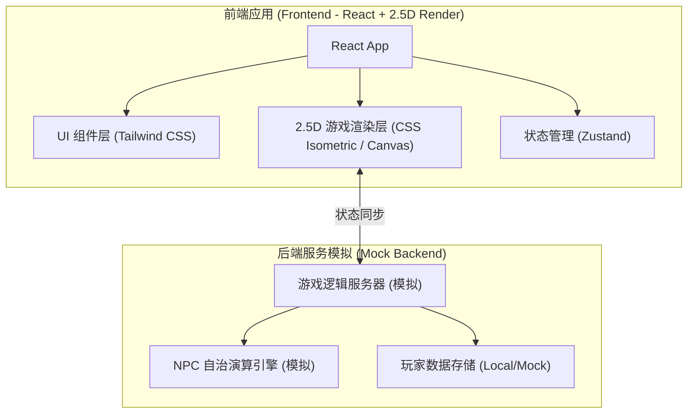
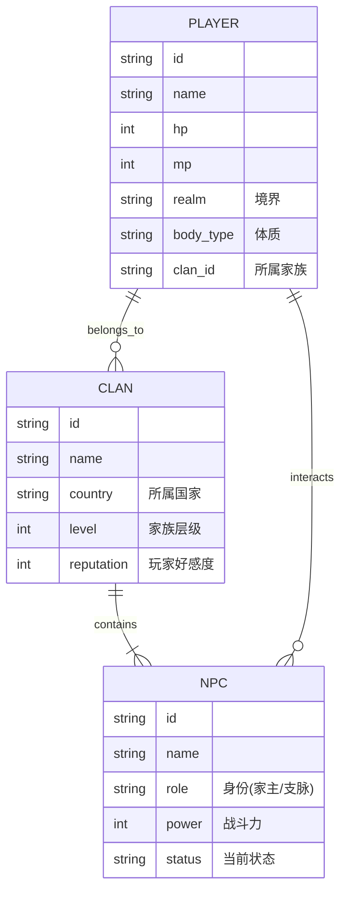

## 1. 架构设计



## 2. 技术栈说明
- **前端框架**: React@18 + Vite
- **样式方案**: TailwindCSS@3 + Lucide React (图标)
- **游戏渲染**: 采用 CSS Isometric Transform (等距变换) 配合 React 渲染简单的 2.5D 像素风网格地图。无需引入复杂重型引擎，保持原型轻量。
- **状态管理**: Zustand (用于管理玩家属性、背包、NPC状态、家族声望等复杂游戏数据)。
- **字体与资源**: 引入开源像素字体，利用 CSS 滤镜和渐变生成像素风占位图与素材。

## 3. 路由定义
| 路由 | 用途 |
|-------|---------|
| `/` | 登录与选服页面，展示服务器状态 |
| `/game` | 核心游戏主界面，包含2.5D地图视窗、角色HUD、NPC交互菜单等 |

## 4. 核心数据模型 (前端状态/模拟后端)
### 4.1 数据模型定义



### 4.2 核心状态结构 (TypeScript)
```typescript
interface Player {
  id: string;
  name: string;
  realm: string; // 凡人, 练气, 筑基, 金丹...
  bodyType: '凡体' | '仙体'; // 初始为凡体
  country: string; // 战国七国之一 (秦、楚、齐、燕、赵、魏、韩)
  clanId: string; // 随机分配至某一家族支脉
  stats: { hp: number; maxHp: number; mp: number; maxMp: number; attack: number };
  position: { x: number; y: number }; // 2.5D坐标
}

interface Clan {
  id: string;
  name: string;
  country: string;
  type: '皇族' | '1级' | '2级' | '3级';
  reputation: number; // 家族对玩家的整体友好度 (过低会引发追杀)
}

interface NPC {
  id: string;
  clanId: string;
  name: string;
  role: '家主' | '长老' | '精英' | '支脉子弟';
  power: number; // 战斗力，后台自动演算成长
  activity: string; // 当前演算状态，如"正在闭关"、"外出历练"
  position: { x: number; y: number };
}
```
