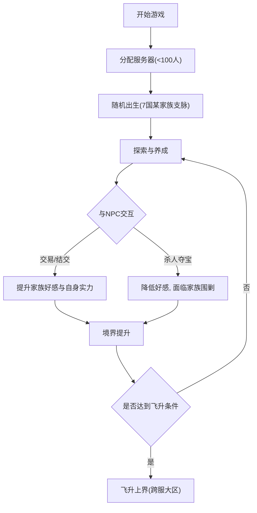

## 1. 产品概述
本项目是一个基于Web的2.5D像素风玄幻修仙多人在线网络游戏（MMORPG）前端原型。
- 游戏主打高自由度的修仙模拟、庞大且自治的NPC生态（基于战国七雄设定的修仙家族体系），以及玩家与环境的深度互动。
- 核心目标是提供一个极具沉浸感的修仙世界，玩家通过修炼最终飞升上界。

## 2. 核心功能

### 2.1 玩家角色与服务器机制
| 功能模块 | 机制描述 | 核心权限/规则 |
|------|---------------------|------------------|
| 服务器承载 | 动态分区分服机制 | 每个区上限100人，满员自动开启新区。相近小区飞升后进入同一大区上界。 |
| 角色出生 | 随机家族分配 | 玩家随机出生在7国的任一家族，身份为支脉子弟，初始体质为“凡体”。 |
| 角色养成 | 自由发展路线 | 玩家在游戏过程中通过各类行为和选择，自定义提升方向和流派。 |

### 2.2 核心系统模块
1. **主游戏界面**: 2.5D像素风地图渲染、角色移动与视野控制、主UI层（包含状态、小地图、快捷栏）。
2. **NPC生态与交互系统**: NPC后台自动演算成长、好感度与仇恨系统、对话/交易/战斗交互面板。
3. **修仙养成系统**: 境界突破、功法修炼、属性面板。
4. **社交与家族系统**: 战国七国地图层级、家族势力展示、整体友好度追踪。

### 2.3 页面详情
| 页面名称 | 模块名称 | 功能描述 |
|-----------|-------------|---------------------|
| 登录与选服页 | 服务器列表 | 展示当前可用区服，满员状态提示，进入游戏入口。 |
| 主游戏页 | 2.5D地图渲染区 | 采用斜45度视角的2.5D像素风渲染，展示角色、NPC、建筑与地形。 |
| 主游戏页 | 角色状态栏 | 显示玩家气血、灵力、境界、修仙阶段及家族归属。 |
| 主游戏页 | 交互控制台 | 提供与附近NPC的交互菜单（交谈、交易、攻击、查探等）。 |
| 主游戏页 | 家族势力与地图 | 显示战国七国版图及当前所在家族的层级（皇族/1级/2级/3级）。 |

## 3. 核心流程
玩家从进入游戏、随机出生到在自治修仙世界中成长并飞升的完整生命周期。

## 4. 用户界面设计
### 4.1 设计风格
- **主色调**: 幽深修仙风（水墨青、朱砂红、暗金）与复古像素艺术结合。
- **界面质感**: 简单的2.5D等距视角（Isometric），UI采用复古像素边框，按钮带有轻微的立体按压感。
- **字体**: 像素风格的中文字体（如Zpix或类似Web字体），保证阅读清晰。
- **布局**: 主界面全屏地图沉浸式体验，UI悬浮于四角及底部边缘（类似传统MMORPG）。
- **动效**: 像素风的微小粒子特效（灵气环绕、攻击刀光），UI弹出的复古切页效果。

### 4.2 页面设计概览
| 页面名称 | 模块名称 | UI元素 |
|-----------|-------------|-------------|
| 登录页 | 选服面板 | 像素风山水背景，卷轴式服务器列表，古风按键。 |
| 主游戏页 | 游戏视窗 | 居中的2.5D等距视角地图，角色位于中心。 |
| 主游戏页 | 玩家HUD | 左上角头像、血条/蓝条、当前境界；右上角小地图。 |
| 主游戏页 | 交互菜单 | 点击NPC弹出的像素风指令轮盘或列表（交易、攻击、交流）。 |
| 主游戏页 | 消息与日志 | 左下角半透明聊天/事件日志框，播报NPC演化或玩家动态。 |

### 4.3 响应式设计
以桌面端优先（Desktop-first），支持鼠标点击移动和交互。
移动端适配通过虚拟摇杆和触摸手势实现视角拖拽和交互。
